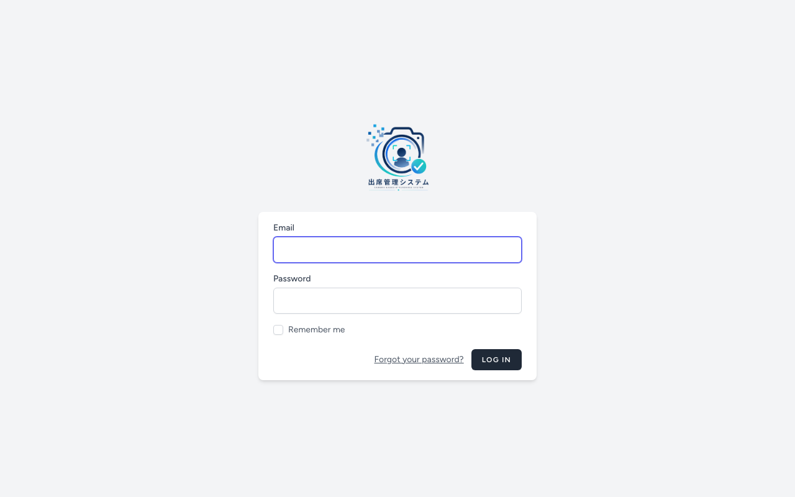
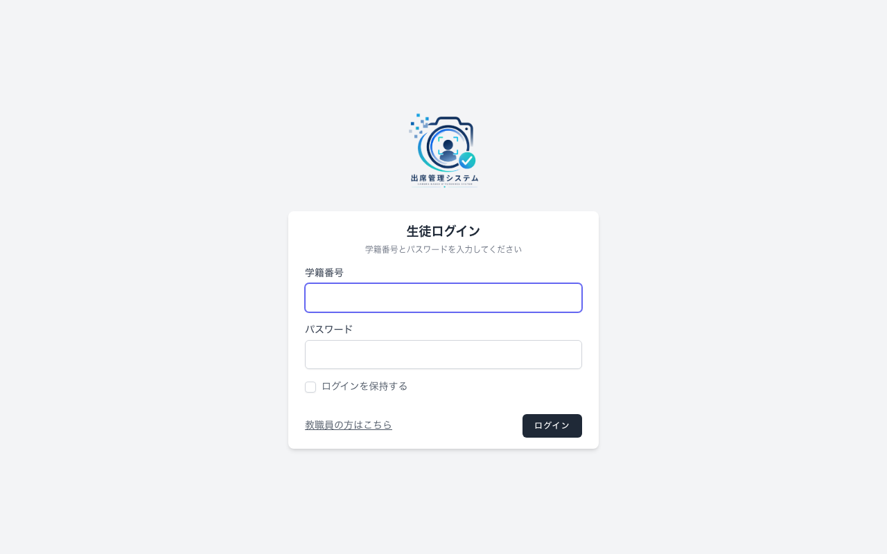
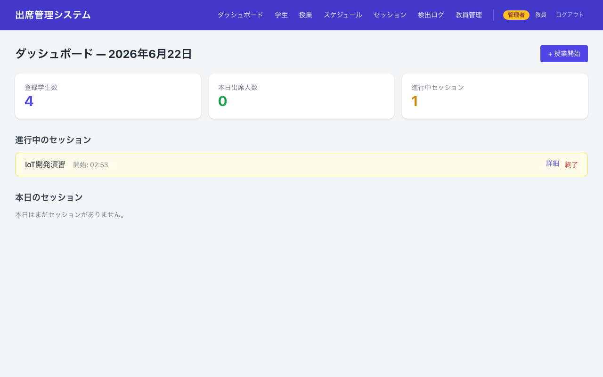
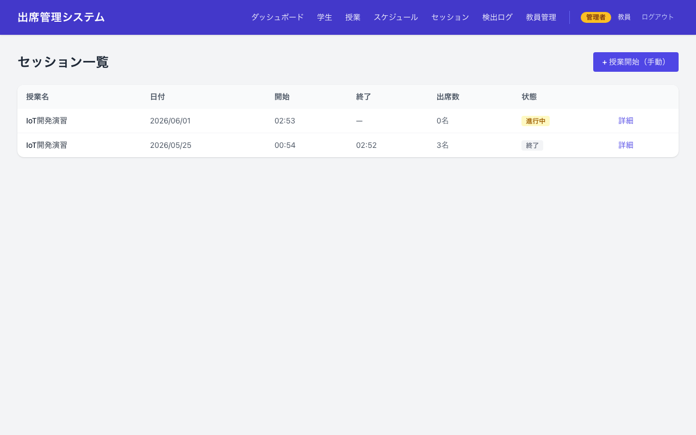
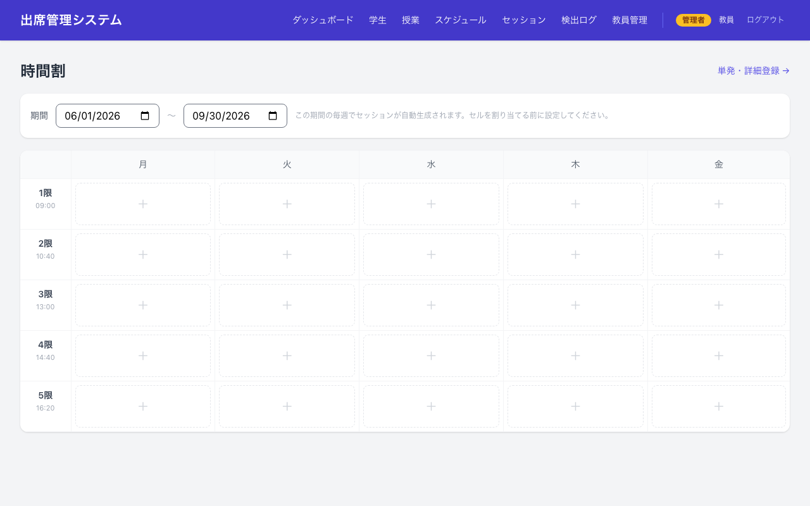
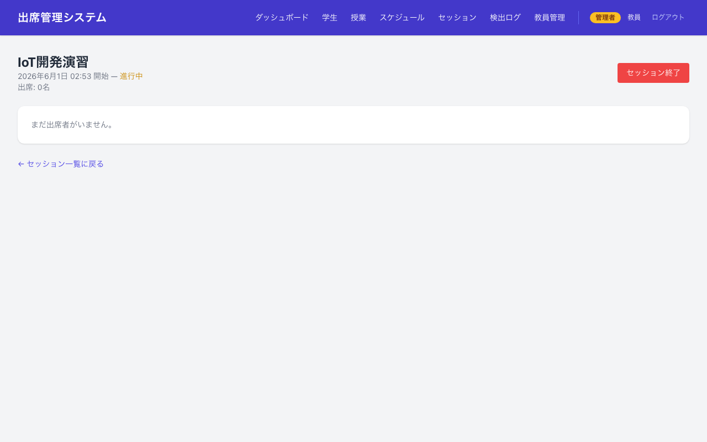
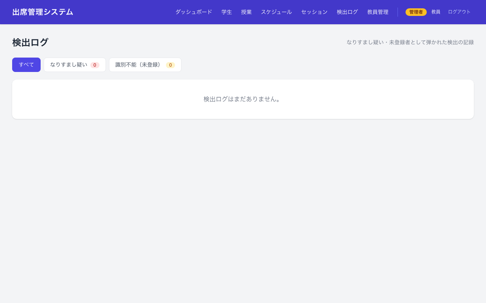

# 出席管理システム（顔認証 + 深度センサー）

OAK-D-Lite-FF（RGB + 深度カメラ）と InsightFace で顔認証を行い、深度データで
なりすまし（写真・スマホ動画）を防ぐ出席管理システム。

- **バックエンド**: Laravel 13 + MySQL（`app/`）
- **カメラ処理**: Python + InsightFace + depthai（`camera/`）
- **開発**: Mac / **本番**: Raspberry Pi

---

## 📸 スクリーンショット

### ログイン画面

<table>
  <tr>
    <td align="center"><b>教職員ログイン</b></td>
    <td align="center"><b>生徒ログイン</b></td>
  </tr>
  <tr>
    <td></td>
    <td></td>
  </tr>
</table>

### 管理画面（教職員）

<table>
  <tr>
    <td align="center"><b>ダッシュボード</b><br><sub>進行中セッション・本日の出席状況をリアルタイム表示</sub></td>
    <td align="center"><b>セッション一覧</b><br><sub>過去〜進行中の授業セッションと出席数</sub></td>
  </tr>
  <tr>
    <td></td>
    <td></td>
  </tr>
  <tr>
    <td align="center"><b>時間割グリッド</b><br><sub>曜日×時限で授業を設定。期間内は毎週自動生成</sub></td>
    <td align="center"><b>セッション詳細</b><br><sub>出席・遅刻・欠席を撮影画像付きで確認・手動修正</sub></td>
  </tr>
  <tr>
    <td></td>
    <td></td>
  </tr>
</table>

### セキュリティ機能

<table>
  <tr>
    <td align="center"><b>検出ログ</b><br><sub>なりすまし疑い・未登録者の検出を記録。撮影画像・深度標準偏差付き</sub></td>
  </tr>
  <tr>
    <td></td>
  </tr>
</table>

---

## 構成

```
attendance-systemV2/
├── app/        … Laravel アプリ（Web画面・API・DB）
└── camera/     … Python カメラ処理（顔認証・深度判定）
```

---

## 🚀 初回セットアップ手順（これだけやればOK）

> 上から順にコマンドを実行すれば動きます。`<...>` は自分の値に置き換えてください。

### 0. 前提（インストール済みであること）

- PHP 8.3+ / Composer / Node.js / MySQL
- Python 3.10+（カメラを使う場合）

### 1. MySQL でデータベースを作成

```bash
mysql -u root -p -e "CREATE DATABASE attendance CHARACTER SET utf8mb4 COLLATE utf8mb4_unicode_ci;"
```

### 2. Laravel アプリのセットアップ（`app/`）

```bash
cd app

# .env を用意（無ければ）
cp .env.example .env

# ↓ .env を編集して以下を設定
#   DB_CONNECTION=mysql
#   DB_DATABASE=attendance
#   DB_USERNAME=<DBユーザー>
#   DB_PASSWORD=<DBパスワード>
#   CAMERA_API_TOKEN=<好きな長い文字列>   ← カメラ認証用。後で camera 側にも同じ値を設定

# 依存インストール + キー生成 + マイグレーション + ビルドを一括実行
composer setup

# 画像を公開するためのシンボリックリンク
php artisan storage:link

# 開発サーバー起動
php artisan serve --port=8000
```

> `composer setup` は「composer install → .env コピー → key:generate → migrate → npm install → npm run build」をまとめて実行します。

### 3. 最初のユーザー登録（= 管理者になる）

1. ブラウザで <http://localhost:8000/register> を開く
2. 名前・メール・パスワードを登録
3. **最初に登録したユーザーは自動的に「管理者(admin)」になります**
   （以降に登録したユーザーは一般教員(teacher)。出席閲覧のみ可能）

### 4. 定期処理（自動セッション生成・欠席記録）を有効化

スケジュールからの出席セッション自動生成・欠席の自動記録は cron で動きます。
**1度だけ**実行すれば登録完了です。

```bash
cd app
bash setup_scheduler.sh           # 登録
# bash setup_scheduler.sh --remove  # 解除したいとき
```

> 登録される定期処理:
> - `sessions:generate` … 毎日 0:05、スケジュールから出席セッションを生成
> - `sessions:finalize` … 5分ごと、予定終了を過ぎたセッションを締めて欠席を記録

### 5. カメラ処理のセットアップ（`camera/`）

**Mac（開発）:**

```bash
cd camera
python3 -m venv venv
source venv/bin/activate
pip install -r requirements.txt

# Laravel と同じトークンを指定
export LARAVEL_API_URL=http://localhost:8000/api
export CAMERA_API_TOKEN=<手順2で設定したのと同じ値>

python main.py            # 通常起動（OAK-D 接続時）
python main.py --test     # OAK-D なしで静止画ロジック確認
```

**Raspberry Pi（本番）:**

```bash
cd camera
bash install_rpi.sh       # システムパッケージ + venv + 依存を自動セットアップ
```

---

## 🗓️ 使い方の流れ

管理者でログイン後、以下の順に登録すると出席判定が動きます。

1. **学生** を登録（`学生` → 顔写真をアップロード or カメラで撮影）
2. **授業** を作成（`授業` → 名前・遅刻猶予分数を設定）
3. **履修登録**（授業一覧の「履修登録」→ その授業を取る学生にチェック）
4. **時間割** を設定（`スケジュール` → 曜日×時限のグリッドで空きコマをクリック → 授業を選ぶだけ）
   - 上部の「期間」で学期（◯月〜◯月）を決めてから割り当てる
   - 単発（特定日のみ）の授業は「単発・詳細登録」から
   - → 割り当てると、その期間の毎週で出席セッションが自動生成される
   - 時限の時刻は `app/config/timetable.php` で変更可能
5. カメラを起動 → 学生が映ると自動で出席判定

### 出席ステータスの判定ルール

| 状況 | ステータス |
|---|---|
| 開始時刻までに検出 | **出席** |
| 開始 〜 +N分（授業ごとに設定。既定20分）に検出 | **遅刻** |
| +N分を過ぎてから検出 | **欠席**（出席しても） |
| 履修者だが終了まで未検出 | **欠席**（セッション終了時に自動記録） |

---

## 🔑 権限（role）

| role | できること |
|---|---|
| **admin**（最初の登録者） | 授業・スケジュール・履修・セッションの管理すべて |
| **teacher**（以降の登録者） | 出席状況の閲覧のみ |

---

## 🛠️ よく使うコマンド（`app/` 内で実行）

```bash
php artisan serve --port=8000     # 開発サーバー起動
php artisan migrate               # マイグレーション
php artisan sessions:generate     # スケジュールから手動でセッション生成
php artisan sessions:finalize     # 予定終了済みセッションを締めて欠席記録
php artisan schedule:list         # 登録済みの定期処理を確認
```

サーバーの止め方: `php artisan serve` を実行中のターミナルで `Ctrl + C`。

---

## ⚙️ カメラ側の主な設定（環境変数 / `camera/config.py`）

| 変数 | 既定値 | 説明 |
|---|---|---|
| `LARAVEL_API_URL` | `http://localhost:8000/api` | Laravel API の URL |
| `CAMERA_API_TOKEN` | （要設定） | Laravel の `.env` と同じ値にする |
| `FACE_MATCH_THRESHOLD` | `0.40` | 顔照合のしきい値（小さいほど厳しい） |
| `TEMPORAL_VOTE_MIN` | `3` | 連続何回の検出一致で出席を確定するか |
| `DEPTH_LIVENESS_THRESHOLD_MM` | `15` | なりすまし検出の深度ばらつき下限 |
| `INSIGHTFACE_MODEL` | `buffalo_l` | `buffalo_s` にすると軽量（RPi で重い場合に推奨） |
| `DEBUG_DISPLAY` | `0` | `1` でプレビュー表示（重い場合は 0） |
